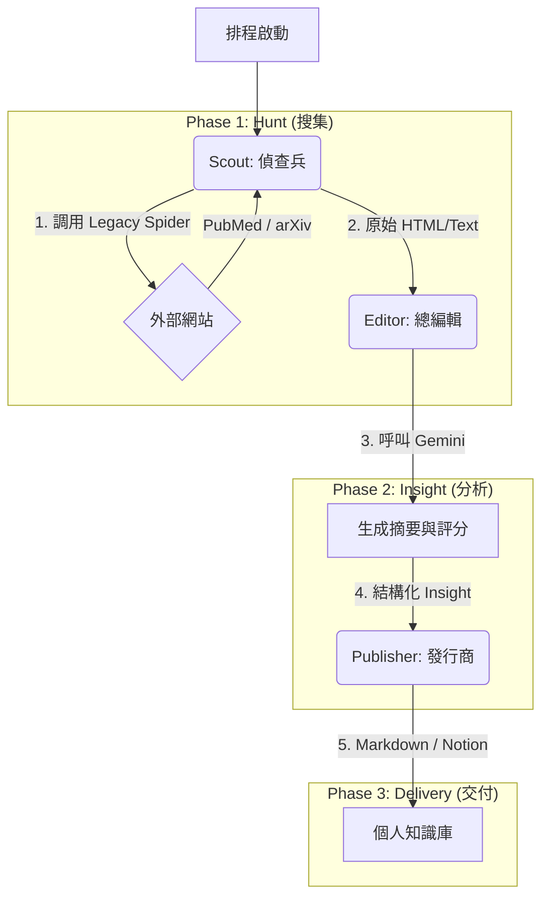

# 🔬 Research Department: Automated Biomedical Intelligence Officer

> **"Zero-Resistance Knowledge Acquisition."**

**Research Module** 是 Ares 的主動偵查系統，旨在解決生醫領域「資訊爆炸」的痛點。它不再被動等待數據輸入，而是主動巡邏 PubMed、arXiv 等前沿陣地，利用 LLM 過濾 90% 的學術雜訊，只將真正高價值的「情報」推送給決策者。

---

## 願景 (Vision)

* **Pain Point (痛點)**：工程師與研究員每天耗費大量時間刷 PubMed、Medium，但獲取的資訊中絕大多數是雜訊或低品質內容。
* **Solution (解法)**：
    1.  **Auto-Patrol**: 每天早上自動巡邏指定來源。
    2.  **AI-Analysis**: 用 LLM 閱讀摘要，進行「相關性評分」與「創新點提取」。
    3.  **Smart-Push**: 只推送「高分」且「有重點」的簡報 (Daily Brief)。

---

## 核心流程 (The Pipeline)

沿用 **ETL (Extract, Transform, Load)** 架構，但針對學術情報場景進行特化：

## 核心模組 (Core Modules)
1. Scout (偵查兵) - scout.py
職責：專門負責「逛網站」與「抓資料」。

整合策略：不重複造輪子。透過 Composition (組合) 模式直接調用 Ares.spider.core。

功能：它不關心瀏覽器如何驅動，只專注於「PubMed 的搜尋框在哪裡」、「下一頁按鈕在哪裡」。

2. Editor (總編輯) - editor.py
職責：專門負責「讀文章」與「判斷價值」。

AI 任務：接收標題與摘要，產出三項指標：

TL;DR: 一句話懶人包。

Innovation: 該研究的創新點為何？

Score: 推薦指數 (1-10)。

3. Daily Brief (日報) - daily_brief.py
職責：負責「排版」與「推送」。

交付物：目前產出 Markdown 日報 (Research_Daily_YYYY-MM-DD.md)，未來將對接 Notion API 直接寫入資料庫。

## 技術戰略 (Technical Strategy)
本模組展示了 物件導向 (OOP) 的核心威力：資產重用 (Asset Reuse)。我們嚴格遵守 DRY (Don't Repeat Yourself) 原則。

### 舊資產盤點 (Legacy Assets Integration)
我們直接繼承或調用 Ares.spider 的底層能力，無需重寫爬蟲核心：

Ares.spider.core.setup_driver: 負責複雜的 Selenium Driver 初始化（包含 Headless 設定、防偵測配置）。

Ares.spider.actions: 負責 safe_click、nuclear_scroll 等戰術動作，處理動態網頁加載。

## Roadmap & Dev Log
[ ] Phase 4.1: 實作 Scout (偵查兵)，整合 Legacy Spider 抓取 PubMed。

[ ] Phase 4.2: 實作 Editor (總編輯)，串接 LangChain 進行論文評分。

[ ] Phase 4.3: 實作 Daily Brief，產出 Markdown 報告。

[ ] Future: 整合 Notion API，實現「零阻力」知識歸檔。