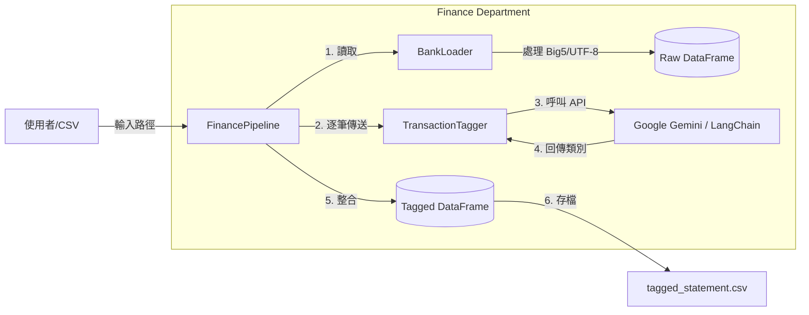

# 🏦 Finance Department: Intelligent Asset Manager

> **"Turning Chaos into Ledger."**

**Finance Module** 是 Ares 的財務情報中心，專為處理台灣銀行體系混亂的 CSV 報表而設計。它整合了強固的資料載入器 (Loader) 與基於 LLM 的語意分析引擎 (Tagger)，能將非結構化的交易明細自動轉化為可分析的財務類別。

---

## 核心模組 (Core Modules)

### **1. Loader (資料海關)**
負責處理最棘手的 I/O 與編碼問題。
- **Encoding Resilience**: 內建 `Auto-Fallback` 機制，優先嘗試 `UTF-8`，失敗自動切換至 `Big5` (常見於台灣銀行報表)，徹底解決亂碼問題。
- **Path Awareness**: 全面採用 `pathlib`，跨作業系統 (Windows/Mac/Linux) 路徑零障礙。

### **2. Tagger (AI 審計員)**
基於 LangChain 架構的語意分類大腦。
- **LangChain Integration**: 採用 `ChatGoogleGenerativeAI` 介面，具備未來無痛切換模型 (如 OpenAI/Claude) 的擴充性。
- **Cost-Effective Model**: 預設搭載 `Gemini-1.5-flash`，在極低成本下維持高準確度的短文本分類能力。
- **Contextual Understanding**: 能理解「全聯」、「World Gym」、「薪資」等語意，自動標記為 `[食, 樂, 薪資]` 等九大類別。

### **3. Pipeline (自動化流水線)**
指揮全場的總控中心。
- **UX Optimization**: 整合 `tqdm` 顯示即時處理進度條，避免長任務焦慮。
- **Safe Export**: 強制輸出 `utf-8-sig` 格式，確保 Excel 開啟時中文顯示正常。

---

## 架構設計 (Architecture)

採用 **Facade Pattern (外觀模式)**，外部只需呼叫 `FinancePipeline` 即可完成所有動作，無需關心內部元件的交互。



## Usage Example
```Python
from Ares.departments.finance.manager import FinancePipeline

# 初始化流水線 (需確保 .env 已設定 GEMINI_API_KEY)
pipeline = FinancePipeline()

# 執行任務：從 Raw Data 到 Insight 只要一行程式碼
# 系統會自動顯示進度條： [====================] 100%
df_result = pipeline.run_pipeline(
    file_path="bank_statement.csv", 
    output_path="tagged_output.csv"
)

# 使用 tabulate 預覽成果
from tabulate import tabulate
print(tabulate(df_result, headers='keys', tablefmt='simple'))
```

## 技術堆疊 (Tech Stack)
Core: Python 3.10+, Pandas

AI Framework: LangChain, Google Generative AI SDK

Security: python-dotenv (API Key 不落地)

UX/UI: tqdm (進度條), tabulate (美觀報表)

## 開發日誌 (Dev Log)
[x] Phase 1: 建立 BankLoader，解決 Big5 亂碼問題。

[x] Phase 2: 串接 Gemini API，並升級至 LangChain 架構。

[x] Phase 3: 完成 FinancePipeline 整合，引入進度條與 CLI 美化。